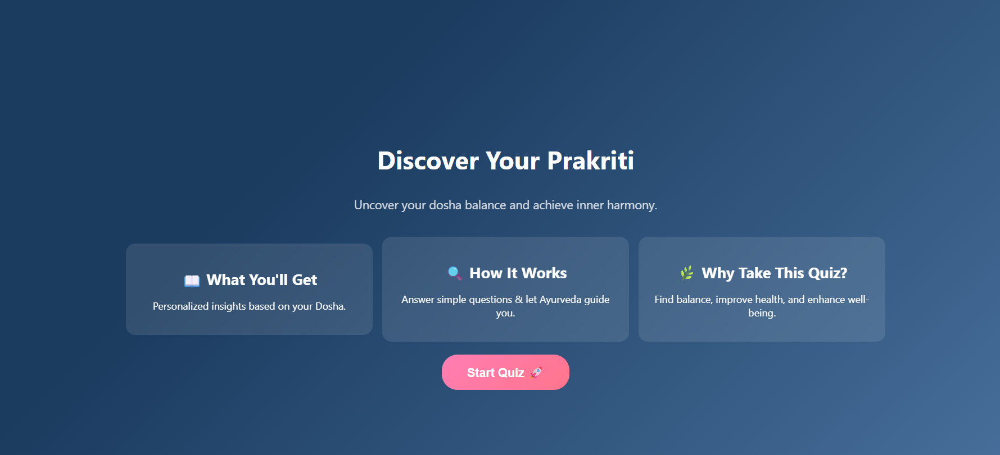

# 🧘‍♂️ Prakriti Analysis – AI-Based Dosha Detection System

An interactive MERN stack web app that determines a user's Ayurvedic Prakriti (Vata, Pitta, Kapha, or their combinations) using an engaging image-based quiz. Based on the result, it provides personalized health, lifestyle, and meditation recommendations.

---

## 🚀 Features

- 👥 Avatar selection (Male/Female)
- 🖼️ 25 image-based personality quiz questions
- ⚖️ Dosha calculation logic with combined types (Vata-Pitta, Pitta-Kapha, etc.)
- 🎡 Spinning wheel animation for dosha reveal
- 🤖 Prakriti Chatbot (BERT + Python Flask + scraping)
- 💡 Health and lifestyle suggestions based on result
- 🌐 Fully responsive UI built with React & Tailwind CSS

---

## 🛠️ Tech Stack

- **Frontend**: React (Vite), Tailwind CSS
- **Backend**: Node.js, Express.js
- **Database**: MongoDB
- **Chatbot**: Python (Flask, BERT, web scraping)
- **Deployment**: Vercel (frontend), Render (backend), local/PythonAnywhere (chatbot)

---
## 📸 Screenshots

### 🏠 Home Page


### ❓ Quiz Interface


### 📊 Result Display


---

## 🧑‍💻 Getting Started

### Clone the repo

```bash
git clone https://github.com/your-username/prakriti-analysis.git
cd prakriti-analysis
